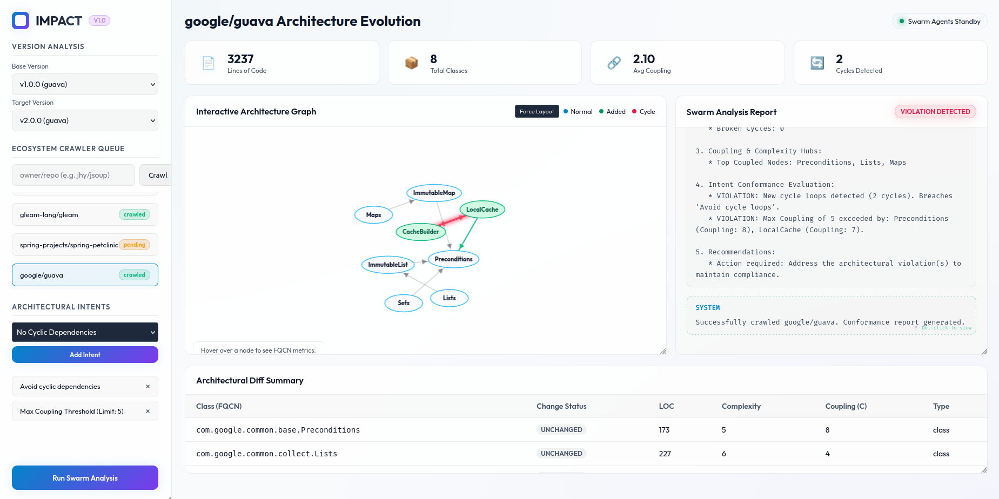

# IMPACT: Intent-based Multi-agent Platform for Architectural Change Tracking

IMPACT is a language-agnostic multi-agent framework designed to monitor and manage the structural evolution of software systems. Drawing inspiration from Intent-Based Networking (IBN) in autonomic computing, IMPACT enables human software architects to specify high-level structural intents, such as preventing cyclic dependencies or limiting complexity growth. A swarm of cooperative agents then evaluates codebase transitions, detects violations, and provides explainable, natural-language refactoring advice.

This project is built to align with the paradigm of Human-AI Collaboration, establishing a structured feedback loop where human expertise guides agentic analysis and governance.

## Repository Structure

The repository is organized as follows:

*   **`core/`**: The core Python package of the IMPACT framework:
    *   `schema/`: Standardized JSON schema for software dependency graphs.
    *   `agents/`: Specialized agent implementations including the Coordinator, Graph, Diff, Metrics, and LLM agents.
    *   `graph_utils.py`: Utility functions for loading graphs and computing structural diffs.
    *   `run_demo.py`: Execution script to run the multi-agent evolution tracker.
    *   `run_dashboard.py`: Launch script for the architect dashboard.
*   **`adapters/`**: Pluggable source code extraction layers:
    *   `java/`: Python-based parser that walks Java project directories, extracts FQCNs, resolves dependency call-graphs, and exports JSON graphs.
*   **`test_projects/`**: Datasets and source folders simulating software evolution:
    *   `telemetry_service_v1/`: Version 1.0.0 Java source code of TelemetryService.
    *   `telemetry_service_v2/`: Version 2.0.0 Java source code of TelemetryService.
    *   `v1_graph.json`: Extracted dependency graph for Version 1.0.0.
    *   `v2_graph.json`: Extracted dependency graph for Version 2.0.0.
*   **`test_impact.py`**: Automated unit test suite to verify graph loading, diff calculations, and coordinator orchestration.

## Installation & Setup

IMPACT targets Python 3.8 or higher. The package (`impact-core`) is published to PyPI. You can install it directly or from source.

### Install from source (recommended while in active development)

On modern Linux/macOS distributions (under PEP 668), Python environments are externally managed. It is recommended to install the package inside a virtual environment:

```bash
# 1. Clone the repository
git clone https://github.com/IMPACT-Project/IMPACT.git
cd IMPACT

# 2. Create and activate a virtual environment
python3 -m venv .venv
source .venv/bin/activate  # On Windows, run: .venv\Scripts\activate

# 3. Install in editable mode with development dependencies
pip install -e ".[dev]"
```

Or install only what you need:

```bash
pip install -e .                        # core only
pip install -e ".[java]"               # + Java AST extractor
pip install -e ".[crawler]"            # + full crawler stack (SQLite)
pip install -e ".[crawler-distributed]" # + PostgreSQL distributed crawler
pip install -e ".[all]"               # everything
```

### Install from PyPI

```bash
# Core only — graph loading, diff, coordinator, SHACL validator
pip install impact-core

# + Java AST extractor (recommended for local extraction)
pip install impact-core[java]

# + Full crawler stack (javalang, pyshacl, rdflib) — single-node SQLite
pip install impact-core[crawler]

# + Distributed crawler (PostgreSQL backend)
pip install impact-core[crawler-distributed]

# Everything
pip install impact-core[all]
```

### Releasing a new version to PyPI

```bash
git tag v1.x.y && git push origin v1.x.y   # GitHub Actions does the rest
```

See [DEPLOY.md](DEPLOY.md) for the full release workflow, one-time PyPI Trusted
Publisher setup, Docker, and Kubernetes deployment instructions.

### Console scripts

After installation the following commands are available on your `PATH`:

| Command | Description |
|---------|-------------|
| `impact-crawl` | GitHub ecosystem crawler CLI |
| `impact-extract` | Java AST dependency graph extractor |
| `impact-demo` | Run the built-in TelemetryService evolution demo |
| `impact-dashboard` | Launch the interactive architect dashboard |


## Running the Project

### Running Graph Extraction (Java Adapter)

```bash
# Via installed console script (after pip install impact-core[java])
impact-extract <projectName> <version> <srcDirectory> <outputJsonPath>

# Or directly
python3 adapters/java/extractor.py <projectName> <version> <srcDirectory> <outputJsonPath>
```

For example, to extract graphs for the mock `TelemetryService` project:

```bash
impact-extract TelemetryService 1.0.0 test_projects/telemetry_service_v1/src test_projects/v1_graph.json
impact-extract TelemetryService 2.0.0 test_projects/telemetry_service_v2/src test_projects/v2_graph.json
```

### Running the Demo

```bash
# Via installed console script
impact-demo

# Or directly
python3 -m core.run_demo
```

This runs the Coordinator agent, orchestrates the swarm, evaluates intents against the graph diffs, and generates the compliance report.

### Running the Architect Dashboard (UI)

```bash
# Via installed console script
impact-dashboard

# Or directly
python3 -m core.run_dashboard
```

This starts a local development server and automatically opens the dashboard interface at `http://localhost:8080/index.html`. In the dashboard, you can visually explore the dependency graphs (with cycles highlighted in red), add new intents, trigger evolution analyses, and view tabular diff metrics.



### Dashboard LLM Analysis API Server

The architect dashboard includes a **double-click conformance report** feature on every crawl success message. The **📊 Metrics tab** (instant, local) is always available. The **🤖 LLM Analysis tab** is powered by the IMPACT API server, which **starts automatically** alongside the dashboard — no separate command needed.

When you run `impact-dashboard` (or `python3 -m core.run_dashboard`) you will see:

```
Starting IMPACT Architect Dashboard...
[LLM API]   Serving on http://localhost:7842/api/llm-analysis
[Dashboard] Serving on http://localhost:8080/index.html
[Browser]   Opening http://localhost:8080/index.html
```

Both servers stop together when you press **Ctrl+C**.

The server uses whichever LLM backend is configured via environment variable (see [LLM / AI Configuration](#llm--ai-configuration) below). Without any key set, it falls back to the built-in rule-based `LLMAgent` analyser — useful offline.


### Running Unit Tests

```bash
python3 -m unittest discover -p "test_*.py"
```


### Running the Model Context Protocol (MCP) Server

To run the stdio-compliant Model Context Protocol server:

```bash
python3 -m core.mcp_server
```

This starts the server on stdio. Any MCP-compatible client (such as Claude Desktop) can connect to it and invoke the `run_evolution_analysis` and `extract_java_graph` tools.

### Running PMD Static Analysis Merger

To integrate PMD static analysis reports into the extracted dependency graph, run:

```bash
python3 adapters/java/static_analyzer.py <graphJsonPath> <pmdJsonPath>
```

For example, to merge our mock PMD report into the Version 2 graph:

```bash
python3 adapters/java/static_analyzer.py test_projects/v2_graph.json test_projects/pmd_report_v2.json
```

### Running the SHACL Structural Validator

To validate your JSON-LD software graphs against our SHACL structural shapes, execute:

```bash
python3 core/shacl_validator.py <graphJsonPath>
```


## How It Works

1.  **Codebase Extraction**: Pluggable language adapters parse a codebase and export its structural dependency network and metrics conforming to the standardized JSON schema.
2.  **Orchestration**: The Coordinator agent manages the evaluation loop.
3.  **Graph Analysis**: The Graph agent loads the JSON-LD files, and the Metrics agent calculates network centralities to identify coupling hubs.
4.  **Version Comparison**: The Diff agent compares adjacent versions to discover added, removed, or modified nodes and edges, as well as newly introduced cycles.
5.  **Intent Conformance**: The LLM agent evaluates the diff metrics against the user-specified architectural intents, outputting a compliance report and refactoring recommendations.

---

## LLM / AI Configuration

The `LLMAgent` (used by both the CLI coordinator and the dashboard API server) supports three LLM backends, selected automatically based on which environment variables are present. Priority order:

| Priority | Variable | Backend |
|----------|----------|---------|
| 1 | `LLM_API_URL` + (optionally) `OPENAI_API_KEY` | Any OpenAI-compatible endpoint (Ollama, vLLM, LM Studio, Azure OpenAI, …) |
| 2 | `OPENAI_API_KEY` | OpenAI API (`gpt-4o-mini` by default, override with `LLM_MODEL`) |
| 3 | `GEMINI_API_KEY` | Google Gemini Developer API (`gemini-1.5-flash`) |
| — | *(none set)* | Built-in rule-based fallback — no external calls, works offline |

### Quick setup

```bash
# Option A — Google Gemini (free tier available)
export GEMINI_API_KEY="AIza..."

# Option B — OpenAI
export OPENAI_API_KEY="sk-..."
export LLM_MODEL="gpt-4o"          # optional, default: gpt-4o-mini

# Option C — Local model via Ollama (or any OpenAI-compatible server)
export LLM_API_URL="http://localhost:11434/v1/chat/completions"
export LLM_MODEL="llama3"

# Then simply start the dashboard (the API server launches automatically)
impact-dashboard
```

To make the variables permanent, add them to your shell profile (`~/.bashrc`, `~/.zshrc`) or a `.env` file (already in `.gitignore`).

> **Security note:** Never commit API keys to version control. The `.gitignore` already excludes `.env`.

---

## Distributed Ecosystem Crawler

IMPACT ships a GitHub ecosystem crawler that discovers, downloads, and analyses large numbers of open-source projects at scale. It can run as a single local process (backed by SQLite) or as a distributed multi-node cluster (backed by PostgreSQL).

### Key Features
* **Multi-Language Support:** The discovery command can filter for any repository language (e.g., `--language java` or `--language rust`).
* **Query Partitioning:** To bypass GitHub's search query limit (max 1,000 results per search), the crawler automatically slices queries into sliding star intervals (e.g. `500..550`, `551..600`, etc., up to `>50000`). This allows building a much larger queue of repositories. Disable via `--no-partition`.
* **Robust Rate-Limit & Backoff:** The crawler dynamically intercepts GitHub's rate-limiting mechanisms. It respects `Retry-After` headers (for secondary/abuse limits), sleeps for primary rate-limit resets (`X-RateLimit-Reset`), and falls back to exponential backoff (2s up to 60s) on HTTP 403/429 codes if headers are missing.

### Running Locally (SQLite, single process)

```bash
# 1. Populate the queue (e.g., with Java repos >= 1000 stars using star partitioning)
python3 -m core.ecosystem_crawler discover --language java --min-stars 1000

# 2. Process queued repositories (runs the crawl execution loop, command alias 'crawl' or 'run')
python3 -m core.ecosystem_crawler crawl --limit 50

# 3. Check queue status and recent transitions
python3 -m core.ecosystem_crawler status
```

---

### Running with Docker (single node)

Build the crawler image:

```bash
docker build -t impact-crawler:latest .
```

Run discovery then crawl with a local SQLite database:

```bash
docker run --rm \
  -v "$(pwd)/test_projects:/app/test_projects" \
  impact-crawler:latest discover --language java --min-stars 1000

docker run --rm \
  -v "$(pwd)/test_projects:/app/test_projects" \
  impact-crawler:latest crawl --limit 50
```

To use a GitHub token (recommended to avoid rate limits):

```bash
docker run --rm \
  -e GITHUB_TOKEN=ghp_yourtoken \
  -v "$(pwd)/test_projects:/app/test_projects" \
  impact-crawler:latest discover --language java --min-stars 1000
```

---

### Running on Kubernetes (multi-node distributed)

The `k8s/` directory contains all Kubernetes manifests. Multiple crawler worker pods coordinate on a shared PostgreSQL queue using `SELECT FOR UPDATE SKIP LOCKED` — each pod atomically claims a repository and no two pods process the same one.

#### Prerequisites

- A running Kubernetes cluster (local: [minikube](https://minikube.sigs.k8s.io/) or [kind](https://kind.sigs.k8s.io/))
- `kubectl` configured to point at it
- The `impact-crawler:latest` image built and available in the cluster

#### Step 1 — Create the namespace

```bash
kubectl apply -f k8s/namespace.yaml
```

#### Step 2 — Create the database secret (not committed to git)

```bash
# Option A: imperative (nothing touches disk — recommended)
kubectl create secret generic postgres-secret \
  --from-literal=username=impact \
  --from-literal=password=yourpassword \
  -n impact-crawler

# Option B: file-based (stays local, already gitignored)
cp k8s/secret.yaml.example k8s/secret.yaml
# Edit k8s/secret.yaml — replace REPLACE_WITH_BASE64_* with real values:
#   echo -n 'impact' | base64
#   echo -n 'yourpassword' | base64
kubectl apply -f k8s/secret.yaml
```

> **Security note:** `k8s/secret.yaml` is listed in `.gitignore` and must never be committed.
> Only `k8s/secret.yaml.example` (with placeholder values) is tracked in git.

#### Step 3 — Deploy PostgreSQL and configuration

```bash
kubectl apply -f k8s/configmap.yaml
kubectl apply -f k8s/postgres.yaml

# Wait for PostgreSQL to be ready
kubectl wait --for=condition=ready pod -l app=postgres \
  -n impact-crawler --timeout=60s
```

#### Step 4 — Run the discovery Job (populates the queue)

```bash
kubectl apply -f k8s/discovery-job.yaml
kubectl wait --for=condition=complete job/crawler-discovery \
  -n impact-crawler --timeout=300s
```

#### Step 5 — Start the distributed crawler workers

```bash
kubectl apply -f k8s/crawler-deployment.yaml
```

This starts **4 parallel worker pods** by default. Watch them drain the queue:

```bash
kubectl logs -l role=worker -n impact-crawler --follow
```

#### Scaling workers up or down

```bash
kubectl scale deployment crawler-worker --replicas=8 -n impact-crawler
```

#### Applying everything at once (after the secret exists)

```bash
kubectl apply -k k8s/
```

#### Removing the deployment

```bash
kubectl delete namespace impact-crawler
```

