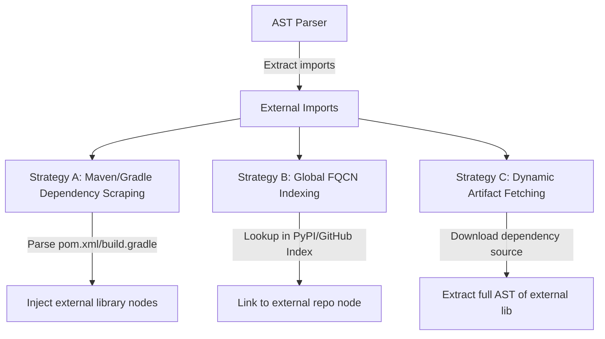

# Cross-Repository API Dependency Parsing Strategies

This brainstorming brief outlines structural strategies to resolve and track API dependency references that cross project and repository boundaries.

---

## 1. The Challenge of External References
When the AST parser analyzes a target repository, it encounters external imports (e.g., `import org.apache.commons.lang3.StringUtils;`). 
* In a local repository scan, these external classes are not part of the parsed AST nodes.
* This leaves external dependencies as dangling unresolved references, lacking coupling metrics or schema compliance checks.

---

## 2. Proposed Strategies

### Strategy A: Build Configuration Scraping (Maven/Gradle)
* **Mechanism**: Read and parse the project's build files (`pom.xml` or `build.gradle`) at the start of analysis.
* **Resolution**: Extract external GAV coordinates (Group, Artifact, Version) and register them as shadow nodes in the dependency graph.
* **Pros**: Low complexity, requires no external internet calls if build files are cached.
* **Cons**: Does not provide internal AST metrics of the dependency itself, only counts references.

### Strategy B: Global FQCN Indexing (Ecosystem Mapping)
* **Mechanism**: Use the SQLite/PostgreSQL database to maintain a lookup index of `FQCN -> Repository`. As the crawler processes more repositories, it builds a mapping of which repository exports which packages.
* **Resolution**: When a class references an unresolved FQCN, query the global index. If found in another repository, create a cross-repository edge.
* **Pros**: Builds a true ecosystem-wide dependency map.
* **Cons**: Query intensive, only works if the referenced repository was already crawled.

### Strategy C: Dynamic Dependency Source Extraction
* **Mechanism**: Integrate with package managers (Maven Central, npm registry, PyPI). When an unresolved external dependency is found, download its source archive (or `-sources.jar` for Java) dynamically.
* **Resolution**: Run the AST extractor on the downloaded source archive, appending all its nodes and edges to the main graph.
* **Pros**: Full transitive coupling and metrics visibility.
* **Cons**: High memory and CPU utilization; potential disk space bloat.
