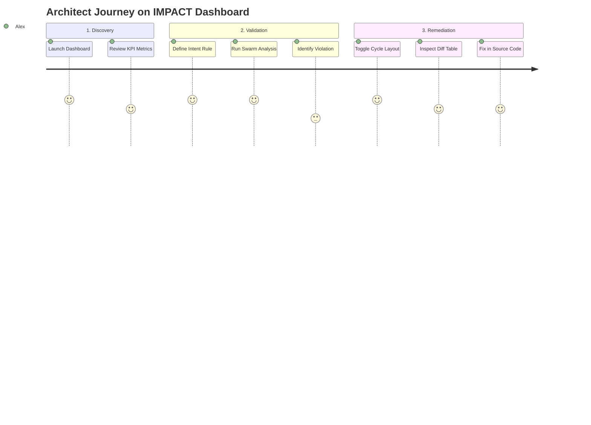

# Developer User Journey Map: IMPACT Architect Dashboard

This document details the user journey maps for system architects and developers using the IMPACT Dashboard to analyze architectural evolution and manage compliance.

---

## 1. Persona: Senior System Architect (Alex)
* **Goal**: Prevent architectural decay (cycles, coupling leaks) in a fast-paced microservices environment.
* **Pain Points**: Lack of visibility into dependency drift, manual validation of design rules takes too long.

### Journey Stages

---

## 2. Step-by-Step Interactive Workflows

### Scenario A: Introducing and Customizing a New Intent Limit
1. **Entrance**: Alex opens the dashboard. The system initializes the default version comparison (v1.0.0 vs v2.0.0).
2. **Form Interaction (Task 13a)**: Alex clicks the dropdown under **Architectural Intents**, selects **Max Coupling Threshold**, enters `4` in the limit input field, and clicks **Add Intent**.
3. **Execution**: Alex clicks **Run Swarm Analysis**. The multi-agent coordinator triggers the metrics engine.
4. **Feedback**: The analysis report highlights a violation because `com.telemetry.Service` or another class exceeds the coupling limit of `4`. The status badge changes to **Violation Detected** in red.

### Scenario B: Resolving Complex Cyclic Dependencies
1. **Analysis**: Under Table 2 metrics, a cycle of length 3 is highlighted in the visualizer graph with red links.
2. **Visual Inspection (Task 18a)**: Alex toggles the **Cycle Layout** button. Nodes instantly settle in a perfect circular ring. The cyclic loop stands out from non-cyclic helper nodes.
3. **Drill Down**: Alex hovers over the nodes in the cycle to see their fully qualified class names (FQCN) and metrics (LOC, complexity, fan-in/fan-out) in the overlay tooltip.
4. **Action**: Alex identifies that `Database` calling `Service` is the illegal reverse dependency causing the cycle, opens the source editor to remove it, and rebuilds the project.
