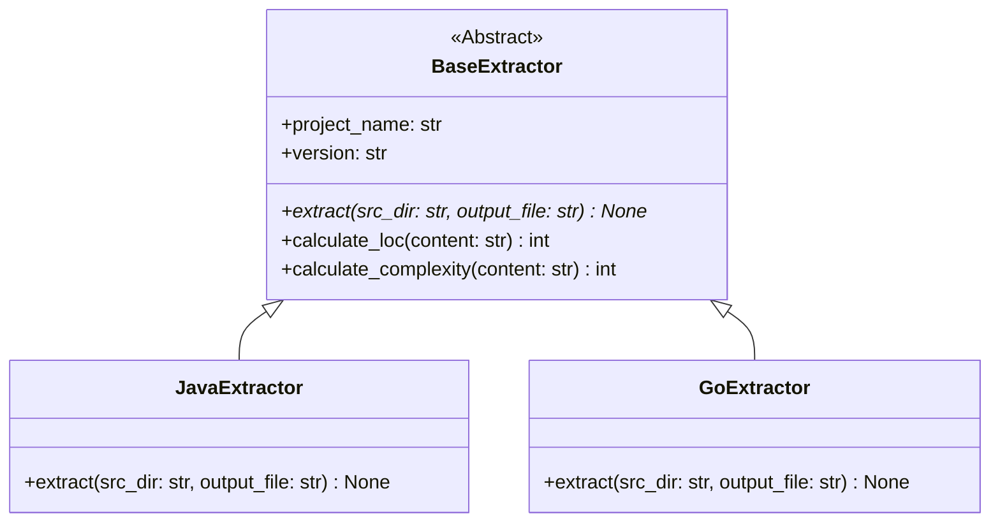

# Extractor Extension API Specification

This document details the interface guidelines and base classes for extending the IMPACT AST extractor framework to support additional programming languages (e.g. C++, Go, Python).

---

## 1. Extension Architecture

To add support for a new language, developers must implement a subclass of the abstract `BaseExtractor` and register it under the entrypoints configuration.



---

## 2. Base Extractor Interface

Below is the Python template for the extension interface:

```python
import os
import json
from abc import ABC, abstractmethod

class BaseExtractor(ABC):
    def __init__(self, project_name: str, version: str):
        self.project_name = project_name
        self.version = version
        self.nodes = {}
        self.edges = []

    @abstractmethod
    def extract(self, src_dir: str, output_file: str) -> None:
        """
        Parses all source files in src_dir, constructs nodes and edges,
        and writes the output graph JSON in the IMPACT-compliant schema.
        """
        pass

    def calculate_loc(self, content: str) -> int:
        """Helper to compute lines of code excluding empty lines and single-line comments."""
        lines = content.splitlines()
        return len([l for l in lines if l.strip() and not l.strip().startswith(("#", "//", "/*", "*"))])

    def write_graph(self, output_file: str, system_metrics: dict) -> None:
        """Standard helper to write graph metadata and nodes/edges to disk."""
        output_data = {
            "projectName": self.project_name,
            "version": self.version,
            "language": self.__class__.__name__.replace("Extractor", ""),
            "systemMetrics": system_metrics,
            "nodes": list(self.nodes.values()),
            "edges": self.edges
        }
        with open(output_file, "w", encoding="utf-8") as f:
            json.dump(output_data, f, indent=2)
```

---

## 3. Registering New Language Extractors
Add entrypoints to the `pyproject.toml` configuration to register custom extractors dynamically:

```toml
[project.entry-points."impact.extractors"]
java = "adapters.java.extractor:JavaExtractor"
go   = "adapters.go.extractor:GoExtractor"
```
This allows the CLI execution engine to dynamically route requests based on file endings or CLI tags:
```bash
impact-extract --lang go --src ./go-service --out ./graph.json
```
