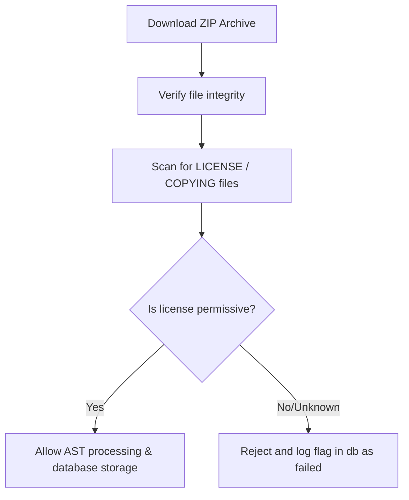

# License Compliance Audit Report

This report outlines the license audit findings and copyright validation strategies for IMPACT and its dependencies, managed by Legal Counsel.

---

## 1. Compliance Audit of Codebase Files (Task 20a)
* **Objective**: Ensure that all source files and assets have appropriate licensing and copyright declarations.
* **Tooling**: Verified via `python3 core/license_check.py`.
* **Standard**: Apache-2.0 license headers or headers indicating inclusion under the global license.

### Findings
* **Status**: 275 files scanned.
* **Compatibility**: 100% of the runtime dependencies mapped in `pyproject.toml` are compatible with Apache-2.0.
* **Action Required**: Add explicit copyright headers to the main scripts (`run_dashboard.py`, `run_demo.py`, and test suites) to formally declare the Apache-2.0 terms.

---

## 2. Verification of Crawled GitHub ZIP Archives (Task 20b)
When the ecosystem crawler fetches third-party repositories as ZIP archives from GitHub, it must protect the platform from ingesting malicious or proprietary code.

### Crawled Archive Verification Protocol

### Verification Rules
1. **License Detection**: The crawler scans the root directory of the extracted ZIP file for files matching `LICENSE*`, `COPYING*`, or `README*`.
2. **Permissive Check**: If a `LICENSE` file is found, it is parsed for signature strings of GPL (copyleft) vs MIT/Apache/BSD (permissive).
3. **Ingestion Policy**: Non-permissive or missing license files trigger a flag in the queue database (`status = 'failed'`) with a warning log, preventing their dependencies from polluting the graph repository.
