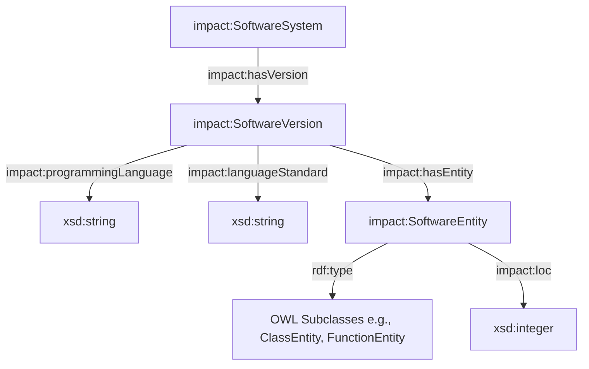

# Ontology Metadata Requirements for Multilingual Graphs (IMPACT Framework)

This specification defines the ontologically-grounded metadata requirements for representing multi-language and heterogeneous software dependency graphs in the IMPACT ecosystem. It establishes a vocabulary, RDF mapping structure, and provenance metadata rules to support interoperability and compliance with FAIR principles.

---

## 1. Metadata Abstraction Strategy

When representing systems that combine multiple programming languages (e.g., polyglot systems using Rust/Python bindings, or cross-language microservices), the ontology must distinguish:
1. **System-level Metadata**: System name, extraction boundary, global statistics.
2. **Version-level Metadata**: Release tags, extraction timestamps, language metadata.
3. **Entity-level Metadata**: Language dialect, code paradigm details (functional vs object-oriented).



---

## 2. RDF Vocabulary Specification

### A. Subclasses of `impact:SoftwareEntity`
To model multi-language code constructs, the ontology defines the following subclasses in `impact.ttl`:
* **`impact:ClassEntity`**: Used for OOP classes (Java, Python, C++, TS).
* **`impact:InterfaceEntity`**: Used for OOP interfaces (Java, TypeScript) and Go interfaces.
* **`impact:StructEntity`**: Used for native data containers/structures in Go and Rust.
* **`impact:ModuleEntity`**: Used for files/modules (Python modules, ES6 modules, Rust modules).
* **`impact:FunctionEntity`**: Used for standalone subroutines and methods (Go methods, Python functions, Rust functions).

---

### B. Language Metadata Properties
The following datatype properties are introduced to capture dialect/compiler properties:

#### 1. `impact:programmingLanguage`
* **RDF Type**: `owl:DatatypeProperty`
* **Domain**: `impact:SoftwareVersion`
* **Range**: `xsd:string`
* **Purpose**: Identifies the primary language used to write this version (e.g., `"Java"`, `"Rust"`, `"Python"`).

#### 2. `impact:languageStandard`
* **RDF Type**: `owl:DatatypeProperty`
* **Domain**: `impact:SoftwareVersion`
* **Range**: `xsd:string`
* **Purpose**: Denotes the version of the language standard used for extraction (e.g., `"Java 17"`, `"Rust 2021 Edition"`, `"ES6"`).

---

## 3. Provenance and Generation Metadata (FAIR Alignment)

To comply with the FAIR (Findable, Accessible, Interoperable, Reusable) data principles, every generated graph must include standardized Dublin Core and PROV-O metadata describing the crawler and extractor context.

### Required Provenance Fields in JSON / RDF:
1. **`dcterms:creator`**: The extractor framework and version (e.g., `IMPACT-Extractor v1.0.0-Java`).
2. **`dcterms:created`**: Timestamp of extraction in ISO 8601 UTC format.
3. **`prov:wasGeneratedBy`**: Reference to the execution run, configuration parameters (e.g., parser mode: `AST` vs `Regex`).

### RDF Serialization Example:
```turtle
@prefix rdf: <http://www.w3.org/1999/02/22-rdf-syntax-ns#> .
@prefix xsd: <http://www.w3.org/2001/XMLSchema#> .
@prefix dcterms: <http://purl.org/dc/terms/> .
@prefix prov: <http://www.w3.org/ns/prov#> .
@prefix impact: <https://w3id.org/impact/ontology#> .

# System definition
<https://w3id.org/impact/projects/jsoup> a impact:SoftwareSystem ;
    impact:projectName "jhy/jsoup" .

# Version definition with multilingual metadata and provenance
<https://w3id.org/impact/projects/jsoup/1.14.2> a impact:SoftwareVersion ;
    impact:versionString "1.14.2" ;
    impact:programmingLanguage "Java" ;
    impact:languageStandard "Java 11" ;
    dcterms:created "2026-07-14T14:00:00Z"^^xsd:dateTime ;
    dcterms:creator "IMPACT-JavaExtractor/v1.0.0" ;
    prov:wasGeneratedBy [
        a prov:Activity ;
        prov:startedAtTime "2026-07-14T13:59:58Z"^^xsd:dateTime ;
        prov:endedAtTime "2026-07-14T14:00:00Z"^^xsd:dateTime ;
        prov:used [
            a prov:Entity ;
            rdfs:label "javalang-AST-parser"
        ]
    ] ;
    impact:hasEntity <https://w3id.org/impact/projects/jsoup/1.14.2/org.jsoup.nodes.Element> .

# Class Entity
<https://w3id.org/impact/projects/jsoup/1.14.2/org.jsoup.nodes.Element> a impact:ClassEntity ;
    rdfs:label "Element" ;
    impact:loc 410 ;
    impact:complexity 75 ;
    impact:inheritanceDepth 2 .
```

---

## 4. SHACL shapes for Polyglot Validation

To validate metadata compliance across different languages, SHACL shapes must dynamically validate nodes based on the target system's language configuration.

```turtle
# Shape to validate that every SoftwareVersion defines language metadata
impact:VersionMetadataShape a sh:NodeShape ;
    sh:targetClass impact:SoftwareVersion ;
    sh:property [
        sh:path impact:programmingLanguage ;
        sh:datatype xsd:string ;
        sh:minCount 1 ;
        sh:message "Every SoftwareVersion must specify impact:programmingLanguage." ;
    ] ;
    sh:property [
        sh:path impact:languageStandard ;
        sh:datatype xsd:string ;
        sh:minCount 1 ;
        sh:message "Every SoftwareVersion must specify impact:languageStandard." ;
    ] ;
    sh:property [
        sh:path dcterms:created ;
        sh:datatype xsd:dateTime ;
        sh:minCount 1 ;
        sh:message "Every SoftwareVersion must have a creation timestamp." ;
    ] .
```
