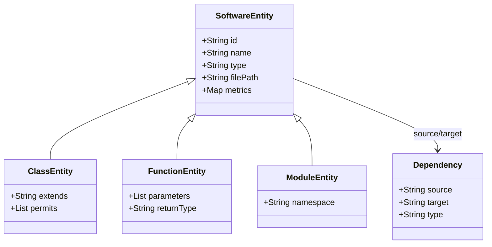

# Domain Modeling Requirements for Non-Java Systems (IMPACT Framework)

This specification defines the extension design patterns, node/edge taxonomies, and AST extraction rules to support non-Java programming language ecosystems in the IMPACT architectural evolution framework. 

---

## 1. Abstraction Layer Architecture

To maintain a language-agnostic coordinator and visualization layer, IMPACT uses a generic core representation while allowing language-specific adapters to map their native AST constructs to standardized entities and dependency types.

### Core Generic Metamodel
* **SoftwareEntity**: The base class for all architectural constructs.
* **Dependency**: A typed relation mapping a source entity to a target entity.



---

## 2. Language-Specific Domain Mappings

Below are the formal mapping requirements for non-Java ecosystems to ensure compatibility with `schema.json` and `impact.ttl` schemas.

### A. Go (Golang) Ecosystem
Go uses a package-oriented design, structural subtyping (implicit interface implementation), and lacks traditional class inheritance.

| Go Native Construct | IMPACT Entity Type | `impact.ttl` OWL Subclass | Notes / Mapping Rules |
|---------------------|--------------------|---------------------------|-----------------------|
| Go Package          | `package`          | `impact:PackageEntity`    | Grouping of files compiled together. ID = FQ package path (e.g., `github.com/user/project/pkg`). |
| Go Struct           | `class`            | `impact:ClassEntity`      | Primary data container. mapped to class for cycle/coupling analysis. |
| Go Interface        | `interface`        | `impact:InterfaceEntity`  | Defines method signatures. |
| Go Function / Method| `function`         | `impact:FunctionEntity`   | Standalone function or struct method receiver. |
| `import "..."`      | `imports` (Edge)   | `impact:dependsOn`        | Package-level dependency import. |
| Implicit Interface  | `implements` (Edge)| `impact:implements`       | Struct implements interface (calculated by comparing method sets). |
| Method / Func Call  | `calls` (Edge)     | `impact:dependsOn`        | Function invokes another function/method. |

#### Go AST Extraction Requirements:
1. **Symbol Resolution**: Standard parser (`go/ast` or `go/types`) must construct the method set of structs and interfaces. If a struct implements all methods of an interface, a structural `implements` edge must be emitted.
2. **Wildcard / Dot Imports**: Support resolution of `import . "module"` references back to their source package namespace.

---

### B. Rust Ecosystem
Rust has modules, crates, traits, struct/enum definitions, and algebraic data types.

| Rust Native Construct | IMPACT Entity Type | `impact.ttl` OWL Subclass | Notes / Mapping Rules |
|-----------------------|--------------------|---------------------------|-----------------------|
| Crate                 | `module`           | `impact:CrateEntity`      | Compilation unit (binary or library). |
| Module (`mod.rs`)     | `package`          | `impact:ModuleEntity`     | Encapsulates items. Inner modules map to nested IDs. |
| Struct / Enum         | `class`            | `impact:ClassEntity`      | Data types. Enums with variants map as class structures. |
| Trait                 | `interface`        | `impact:TraitEntity`      | Abstract interface definitions. |
| `impl Trait for Struct` | `implements` (Edge) | `impact:implements`     | Explicit trait implementation. |
| `use crate::...`      | `imports` (Edge)   | `impact:dependsOn`        | Import mapping. |
| Function / Method     | `function`         | `impact:FunctionEntity`   | Native functions and trait-bound implementations. |

#### Rust AST Extraction Requirements:
1. **Cargo Integration**: The Rust adapter should leverage `cargo metadata` to map out-of-crate external dependencies.
2. **Macro Expansion**: Parser must be resilient to macro invocations (e.g., `lazy_static!`, `derive(...)`) without breaking the module structure.
3. **Traits Mapping**: Trait inheritance (`trait Sub: Super`) must map to an `inherits` edge between the trait entities.

---

### C. Python Ecosystem
Python is a dynamically-typed, multi-paradigm language where modules are single files, and packages are directories.

| Python Native Construct | IMPACT Entity Type | `impact.ttl` OWL Subclass | Notes / Mapping Rules |
|-------------------------|--------------------|---------------------------|-----------------------|
| Directory with `__init__` | `package`        | `impact:PackageEntity`    | Python package. |
| File (`.py`)            | `file`             | `impact:ModuleEntity`     | Python module. |
| Class                   | `class`            | `impact:ClassEntity`      | Explicit class structures. |
| Function / Method       | `function`         | `impact:FunctionEntity`   | Standalone module function or class method. |
| `import ...` / `from`   | `imports` (Edge)   | `impact:dependsOn`        | Module or entity import. |
| `class Child(Parent)`   | `inherits` (Edge)  | `impact:inherits`         | Class inheritance (supports multiple inheritance). |

#### Python AST Extraction Requirements:
1. **Dynamic Import Resolution**: Parse dynamic imports inside functions and handle `sys.path` alterations via dynamic fallback.
2. **Name Resolution**: Since Python is dynamically typed, if the exact type of a reference cannot be inferred statically, the adapter must use a lexical fallback to match method calls (`obj.method()`) against all defined methods of that name in the scope.

---

### D. TypeScript / JavaScript Ecosystem
TS/JS uses ES6 modules, commonjs `require`, prototype chains, and TS interfaces.

| TS Native Construct | IMPACT Entity Type | `impact.ttl` OWL Subclass | Notes / Mapping Rules |
|---------------------|--------------------|---------------------------|-----------------------|
| npm package / folder | `package`         | `impact:PackageEntity`    | Defined by `package.json`. |
| File (`.ts`/`.js`)  | `file`             | `impact:ModuleEntity`     | Individual ES6 module. |
| Class               | `class`            | `impact:ClassEntity`      | ES6 classes. |
| Interface (TS)      | `interface`        | `impact:InterfaceEntity`  | TypeScript compile-time interface. |
| `import` / `require` | `imports` (Edge)   | `impact:dependsOn`        | Module dependency import. |
| `extends`           | `inherits` (Edge)  | `impact:inherits`         | Class or Interface inheritance. |

---

## 3. Abstract Adaptor Interface Specification

Every non-Java parser must subclass the base extractor interface to enforce output predictability:

```python
from abc import ABC, abstractmethod

class BaseExtractor(ABC):
    def __init__(self, project_name: str, version: str):
        self.project_name = project_name
        self.version = version
        self.nodes = {}
        self.edges = []

    @abstractmethod
    def extract(self, src_dir: str, output_json_path: str) -> None:
        """
        Parses source directory, extracts abstract syntax trees, 
        calculates architectural metrics, and saves a JSON graph 
        conforming to schema.json.
        """
        pass
```

### Metrics Schema Mapping Requirements
Each adapter must calculate the following metrics at the node level:
1. **loc**: Physical lines of code (excluding blanks and comments).
2. **complexity**: Cyclomatic complexity.
3. **fanIn / fanOut**: Structural incoming and outgoing dependencies.
4. **coupling**: Z-Score class/module coupling based on incoming/outgoing edges.
5. **inheritanceDepth**: Maximum height of the entity in the inheritance/dependency hierarchy tree (default = `0` for entities without parents).

---

## 4. SHACL Constraint Extension for Heterogeneous Graphs

To validate multilingual graphs, `shapes.ttl` must support relaxed constraints for non-class entities:

```turtle
# General SoftwareEntity shape validation
impact:SoftwareEntityShape a sh:NodeShape ;
    sh:targetClass impact:SoftwareEntity ;
    sh:property [
        sh:path impact:loc ;
        sh:datatype xsd:integer ;
        sh:minCount 1 ;
    ] ;
    sh:property [
        sh:path impact:complexity ;
        sh:datatype xsd:integer ;
        sh:minCount 1 ;
    ] .

# Specific constraint for class structures
impact:ClassEntityShape a sh:NodeShape ;
    sh:targetClass impact:ClassEntity ;
    sh:property [
        sh:path impact:inheritanceDepth ;
        sh:datatype xsd:integer ;
        sh:minCount 1 ;
    ] .
```
