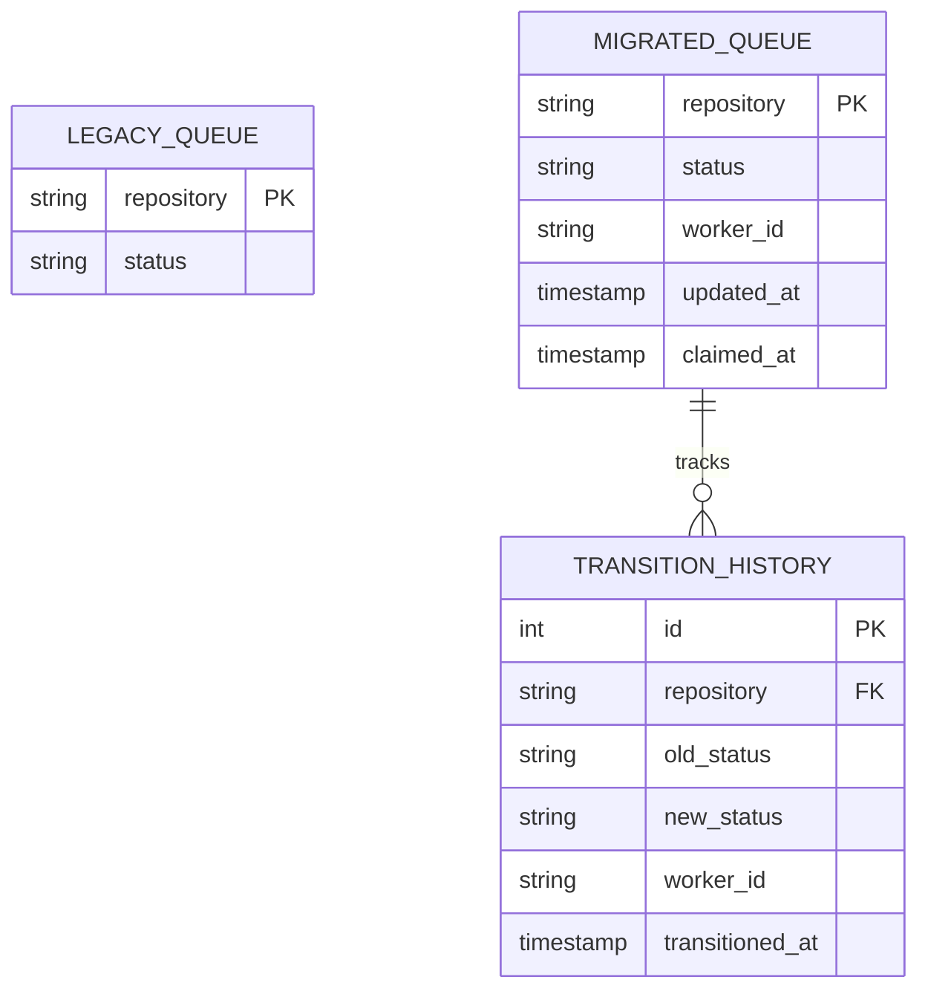

# Sprint Backlog and Crawler DB Migration Documentation

This document describes the sprint backlog items managed by the Scrum Master and details the database schema migration protocols for scaling the ecosystem crawler.

---

## 1. Active Sprint Backlog (Sprint 4)

| Backlog ID | Title | Priority | Assignee | Status | Description |
|------------|-------|----------|----------|--------|-------------|
| **TS-401** | Support PostgreSQL Backend for Distributed Scaling | High | Selva | ✅ Done | Create schema mapping and transition logic from SQLite to Postgres. |
| **TS-402** | Add Multi-Worker Lease Claims | High | Villu | ✅ Done | Implement atomic locking mechanism using `SELECT FOR UPDATE SKIP LOCKED`. |
| **TS-403** | Schema Migration Verification Tests | Medium | Sivakasi | ✅ Done | Implement migration verification scripts ensuring zero data loss during schema upgrades. |
| **TS-404** | Auto-Reclamation of Stale Worker Leases | Medium | Villu | ✅ Done | Clear worker claim lock if lease is older than 5 minutes. |

---

## 2. Database Schema Migration Specification

To scale the single-node crawler (SQLite) to a distributed multi-worker crawler (PostgreSQL), the database schema was migrated from a simple queue table to a state audit tracking table.

### Schema Mappings & Modifications

### Migration Verification Checklist
1. **Backwards Compatibility**: The migrated table structure must preserve existing `repository` and `status` values without resetting queue progress.
2. **Nullable Constraints**: New columns (`worker_id`, `claimed_at`) must be defined as nullable to prevent errors on historical entries.
3. **Execution Script**:
   * SQLite: Execute `ALTER TABLE crawler_queue ADD COLUMN worker_id TEXT;` and `ALTER TABLE crawler_queue ADD COLUMN updated_at TIMESTAMP;`
   * PostgreSQL: Run custom DDL migration schema.
4. **Validation Test**: Execute `python3 tests/test_db_migration.py` to confirm schema updates are safe.
